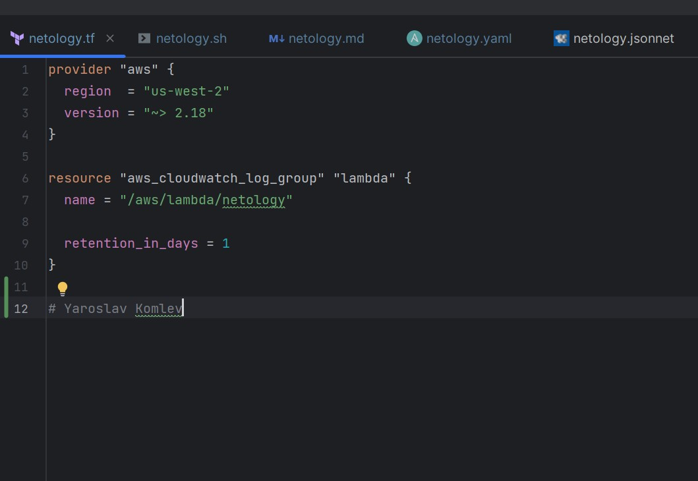
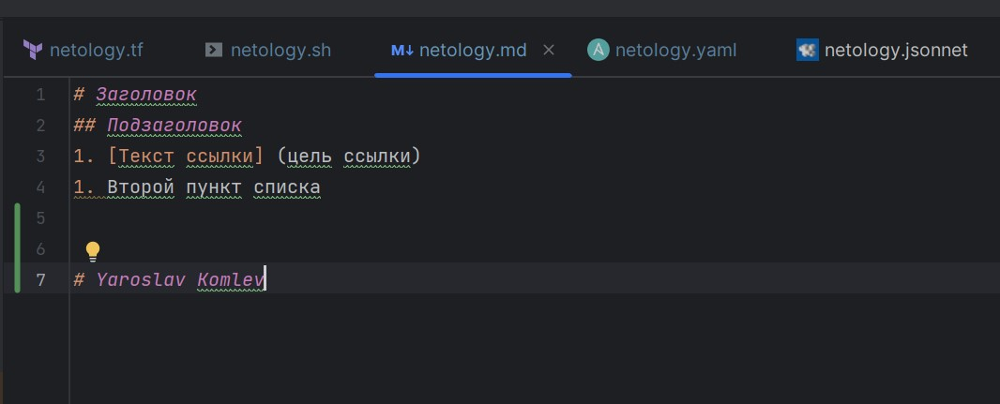
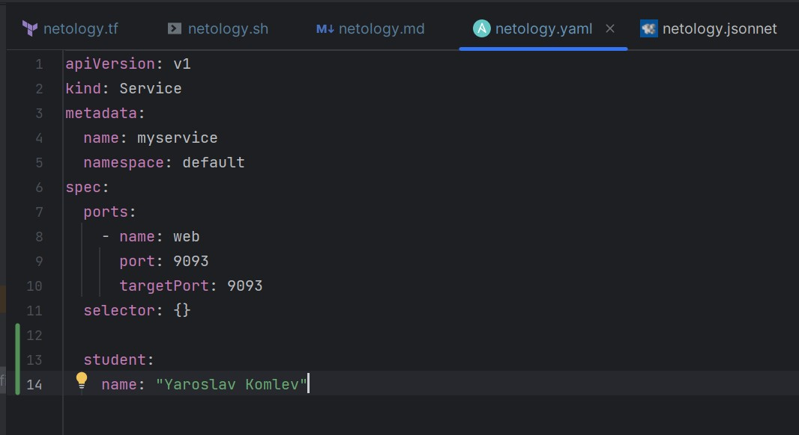
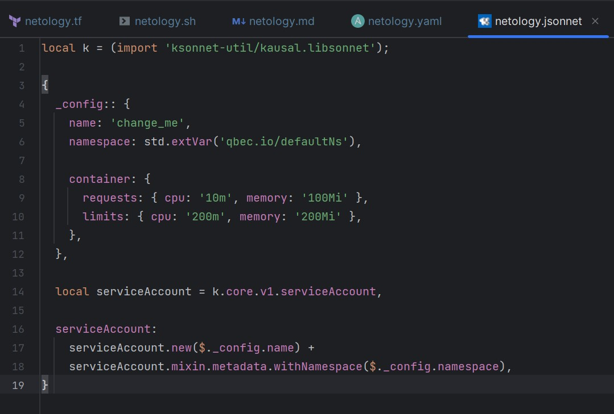

# Домашнее задание по лекции «1.1. Введение в DevOps»

## Задание №1 - Подготовка рабочей среды

### Результат настройки **PyCharm**

- Terraform

- Bash

- Markdown

- Yaml

- Jsonnet

---

## Задание №2 - Описание жизненного цикла задачи (разработки нового функционала)

### Процесс решения задачи
1.	Менеджеры собирают обратную связь от покупателей, формируя список доп. функционала, который нужно добавить.
2.	Разработчики реализуют составленный по обратной связи список задач.
3.	Тестировщики проводят тестирование.
4.	Менеджеры утверждают готовые к выпуску доп. функционал. Не утверждённые отправляются на доработку.
5.	Новая версия интернет-магазина заливается на "боевой" хостинг. Перед обновлением делается резервная копия.
6.	В случае возникновения ошибок в продакшене определяется "сбойный" доп функционал . По возможности в релизной сборке откатываются только они, иначе откатываются все изменения этапа. Полученная сборка заливается на хостинг.
### Задачи DevOps-инженера
DevOps инженер должен обеспечить эффективное взаимодействие менеджеров, разработчиков и тестировщиков в процессе разработки (внедрения новых возможностей в интернет-магазин) для чего:
•	выбрать подходящие инструменты (ПО, сервисы)
•	подготовить всю необходимую инфраструктуру (среды разработки, тестовые окружения)
•	наладить непосредственно сам процесс разработки и тестирования (настройка ПО и сетевого взаимодействия между средами)
•	добиться максимальной автоматизации процессов (CI, мониторирование, оповещение, выгрузка на сервера и т.п.)

# Домашнее задание по лекции «2.1. Системы контроля версий»

**/.terraform/*` - игнорировать всё содержимое каталогов `.terraform` на любом уровне вложенности.
Файл `.terraform` игнорироваться не будет.

Примеры:

- .terraform/file1.md

- dir1/.terraform/file2.md

- dir2/dir3/dir4/.terraform/file3.md

---

`*.tfstate` - игнорировать файлы/каталоги имя которых заканчивается на `.tfstate`.

Примеры:

- dir1/file1.tfstate

- dir1/dir2/dir3/zero.tfstate

- dir4.tfstate

---

`*.tfstate.*` - игнорировать файлы/каталоги имя которых содержит выражение `.tfstate.` с любым числом любых символов до и после него (выражения).

Примеры:

- file1.tfstate.ext1

- dir1/file2.tfstate.

- dir2/dir3.tfstate.dir3/file4.txt

---

`crash.log` - игнорировать файлы/каталоги с именем `crash.log`.

Примеры:

- crash.log

- logs/crash.log

---

`crash.*.log` - игнорировать файлы/каталоги имя которых начинается на `crash.` и заканчивается на `.log`.

Примеры:

- crash.01.log

- logs/crash.01-13_5.log

- logs/crash.15.log

- logs/crash..log

---

`*.tfvars` - игнорировать файлы/каталоги имя которых заканчивается на `.tfvars`.

Примеры:

- file1.tfvars

- dir1/file1.tfvars

---

`override.tf` - игнорировать файл/каталог с именем `override.tf`.

Примеры:

- override.tf

- dir1/override.tf

- dir1/dir2/override.tf

---

`override.tf.json` - игнорировать файл/каталог с именем `override.tf.json`.

Примеры:

- override.tf.json

- dir1/override.tf.json

- dir1/dir2/override.tf.json

---

`*_override.tf` - игнорировать файлы/каталоги имя которых заканчивается на `_override.tf`.

Примеры:

- test_override.tf

- dir1/file1_override.tf

- dir2/dir3/_override.tf

---

`*_override.tf.json` - игнорировать файлы/каталоги имя которых заканчивается на `_override.tf.json`.

Примеры:

- test_override.tf.json

- dir1/file1_override.tf.json

- dir2/dir3/___override.tf.json

- _override.tf.json

---

`.terraformrc` - игнорировать файл/каталог с именем `.terraformrc`.

Примеры:

- .terraformrc

- dir1/.terraformrc

---

`terraform.rc` - игнорировать файл/каталог с именем `terraform.rc`.

Примеры:

- terraform.rc

- dir1/terraform.rc

- dir2/dir3/terraform.rc

