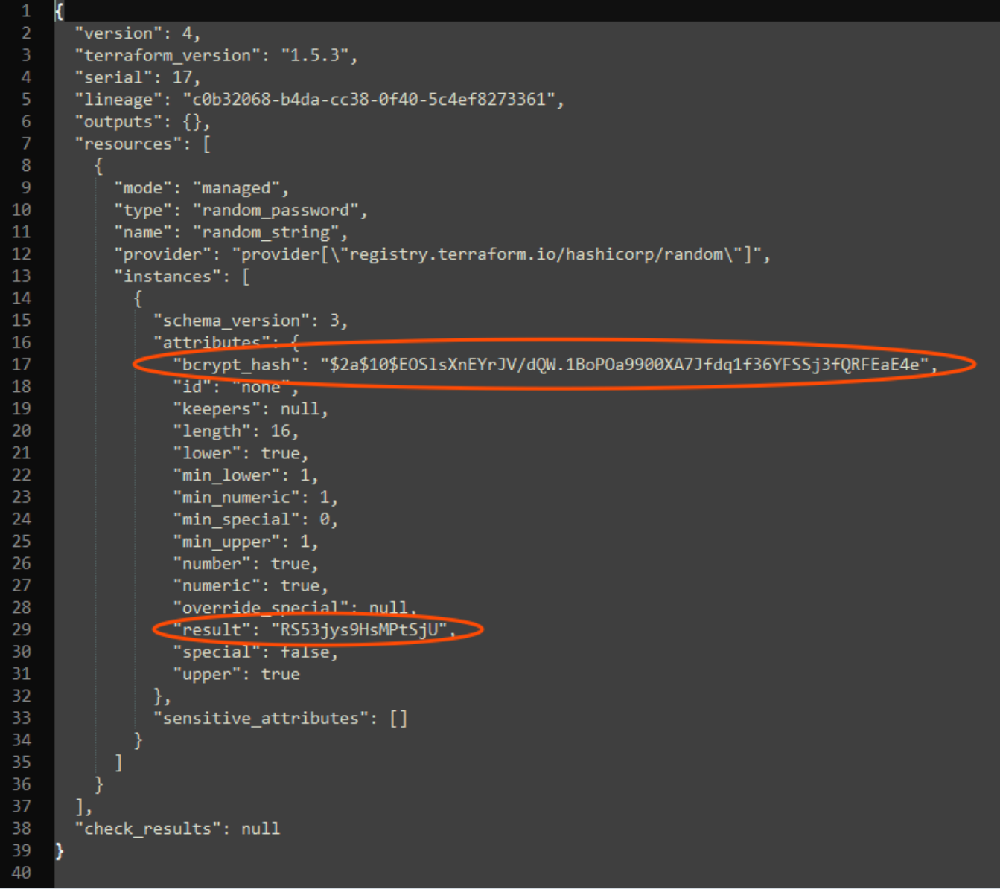
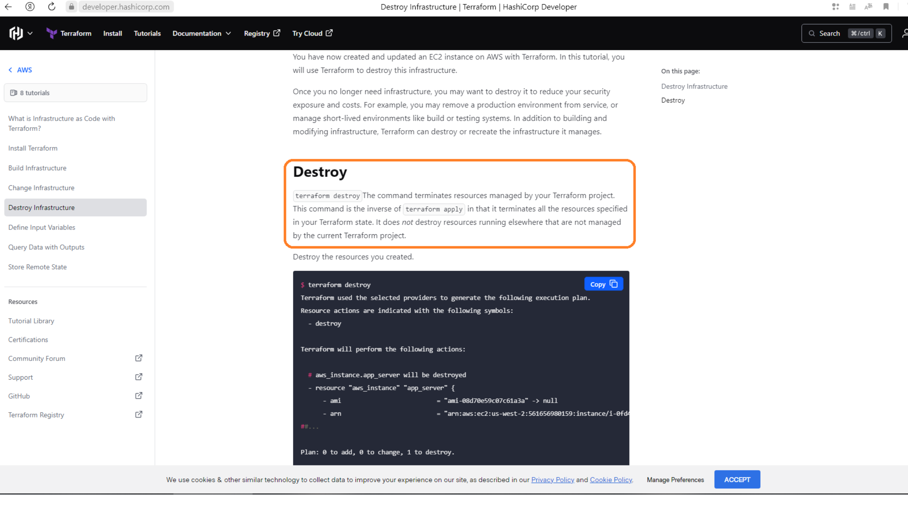

# Домашнее задание к занятию «Введение в Terraform»

## Решение к Задаче 1

>Изучите файл **.gitignore**. В каком terraform файле согласно этому **.gitignore** допустимо сохранить личную, секретную информацию?

Личную или секретную информацию можно хранить в любом файле указанным в **.gitignore**. На то и нужен **.gitignore** чтобы файлы содержащие чувствительную информацию не попали в открытый репозиторий.

>Задание 1.2. Согласен что .gitignore для чувствительных данных, но в задании нужно указать файл в котором вы будете хранить свои секретные данные

**.tfstate** - файл, который хранит текущее состояние инфраструктуры, содержит информацию о ресурсах, которые уже были созданы и их текущих свойствах. Файл состояния может храниться локально или удаленно, это позволяет хранить общую копию файла состояния и управлять им с нескольких хостов. Важно отметить, что файл состояния является важным аспектом управления инфраструктурой, поэтому необходимо обеспечить его блокировку на время работы с ним. Также, нужно понимать, что файл состояния является конфиденциальным, и его необходимо хранить в безопасном месте, так как он содержит важную информацию о всей инфраструктуре.

>Выполните код проекта. Найдите  в State-файле секретное содержимое созданного ресурса **random_password**, пришлите в качестве ответа конкретный ключ и его значение.

```text
$2a$10$yMQNEFU0sfUR/l5X0CVKx.QguybOhn2HjPa8ZLWf39.LLxEw8UVP.
 |  |  |      |
 |  |  |      |
 |  |  |      hash-value = QguybOhn2HjPa8ZLWf39.LLxEw8UVP.
 |  |  |
 |  |  salt = yMQNEFU0sfUR/l5X0CVKx.
 |  |
 |  cost-factor => 10 = 2^10 rounds
 |
 hash-algorithm identifier => 2a = BCrypt
 ```

- **hash-algorithm identifier** - 2 символа префикс идентификатора алгоритма хэширования. "$2a$" or "$2b$" указывает на BCrypt
- **cost-factor** - Коэффициент затрат (n). Представляет показатель степени, используемый для определения количества итераций 2^n
- **salt** - 16-байтовая (128-битная) соль, base64, закодированная в 22 символа
- **hash-value** - 24-байтовый (192-битный) хэш, кодированный base64 до 31 символа

>Задание 1.3 Нужно сделать это: секретное содержимое созданного ресурса random_password, пришлите в качестве ответа конкретный ключ и его значение можно скрин приложить из state для наглядности и выделить конкретное место



>Раскомментируйте блок кода, примерно расположенный на строчках 29-42 файла **main.tf**.  
>Выполните команду ```terraform validate```.  
>Объясните в чем заключаются намеренно допущенные ошибки? Исправьте их.

```bash
vagrant@VM2:/src$ terraform validate
╷
│ Error: Missing name for resource
│
│   on main.tf line 23, in resource "docker_image":
│   23: resource "docker_image" {
│
│ All resource blocks must have 2 labels (type, name).
╵
╷
│ Error: Invalid resource name
│
│   on main.tf line 28, in resource "docker_container" "1nginx":
│   28: resource "docker_container" "1nginx" {
│
│ A name must start with a letter or underscore and may contain only letters, digits, underscores, and dashes.

vagrant@VM2:/src$ terraform validate

│ Error: Reference to undeclared resource
│
│   on main.tf line 30, in resource "docker_container" "nginx":
│   30:   name  = "example_${random_password.random_string_FAKE.resulT}"
│
│ A managed resource "random_password" "random_string_FAKE" has not been declared in the root module.
╵
vagrant@VM2:/src$ terraform validate
╷
│ Error: Unsupported attribute
│
│   on main.tf line 30, in resource "docker_container" "nginx":
│   30:   name  = "example_${random_password.random_string.resulT}"
│
│ This object has no argument, nested block, or exported attribute named "resulT". Did you mean "result"?
```

Ошибка в 23 строке **main.tf**: Все блоки ресурсов должны иметь 2 метки. Исправление: Добавляем имя "nginx"

Правильный вариант блока кода:

```hcl
resource "docker_image" "nginx" {
  name = "nginx:latest"
  keep_locally = true
}
```

Ошибка в 28 строке **main.tf**: Имя должно начинаться с буквы или символа подчеркивания и может содержать только буквы, цифры, знаки подчеркивания и тире. Исправление: исправляем имя "1nginx" на "nginx"

Ошибка в 30 строке **main.tf**: Управляемый ресурс "random_password" "random_string_FAKE" не был объявлен в корневом модуле. Исправление: исправляем "random_string_FAKE" на "random_string"

Ошибка в 30 строке **main.tf**: Объект не имеет аргумента, вложенного блока или экспортируемого атрибута с именем "resulT". Исправление: исправляем "resulT" на "result"

Правильный вариант блока кода:

```hcl
resource "docker_container" "nginx" {
  image = docker_image.nginx.image_id
  name  = "example_${random_password.random_string.result}"

...

}
```

>Выполните код. В качестве ответа приложите вывод команды ```docker ps```

```bash
vagrant@VM2:/src$ docker ps
CONTAINER ID   IMAGE          COMMAND                  CREATED              STATUS          PORTS                  NAMES
85118e22f9bb   89da1fb6dcb9   "/docker-entrypoint.…"   About a minute ago   Up 58 seconds   0.0.0.0:8000->80/tcp   example_t3GWKTLRAxlGUh6Q
```

>Замените имя docker-контейнера в блоке кода на ```hello_world```, выполните команду ```terraform apply -auto-approve```.
>Объясните своими словами, в чем может быть опасность применения ключа  ```-auto-approve``` ?

Использование ```-auto-approve``` флага является опасным, поскольку некоторые ошибки в **main.tf** могут привести к необратимой потере данных или уничтожению базы данных. Эти ошибки будут применены без запроса одобрения.

>В качестве ответа дополнительно приложите вывод команды ```docker ps```

```bash
vagrant@VM2:/src$ docker ps
CONTAINER ID   IMAGE          COMMAND                  CREATED          STATUS          PORTS                  NAMES
87f8db035a48   89da1fb6dcb9   "/docker-entrypoint.…"   18 seconds ago   Up 13 seconds   0.0.0.0:8000->80/tcp   hello_world_t3GWKTLRAxlGUh6Q
```

>Уничтожьте созданные ресурсы с помощью **terraform**. Убедитесь, что все ресурсы удалены. Приложите содержимое файла **terraform.tfstate**.

```hcl
{
  "version": 4,
  "terraform_version": "1.5.3",
  "serial": 11,
  "lineage": "8c1da195-b693-008d-a92b-db267c48defd",
  "outputs": {},
  "resources": [],
  "check_results": null
}
```

>Объясните, почему при этом не был удален docker образ **nginx:latest** ?

Команда ```terraform destroy``` удаляет только те ресурсы, которыми управляет сам Terraform. Ресурсы, которые он создал  и передал в управление другому сервису не удаляются командой ```terraform destroy```.

>Ответ подкрепите выдержкой из документации провайдера.



>Задание 1.8. А если я скажу что в конкретном случае terraform влиял на docker и может удалить image, но ему запретили это делать. Вопрос. Как это реализовано?

```hcl
resource "docker_image" "nginx" {
  name         = "nginx:latest"
