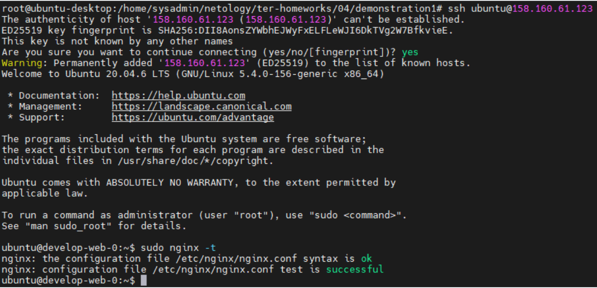
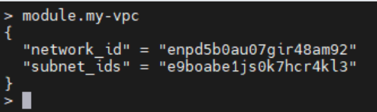
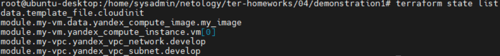
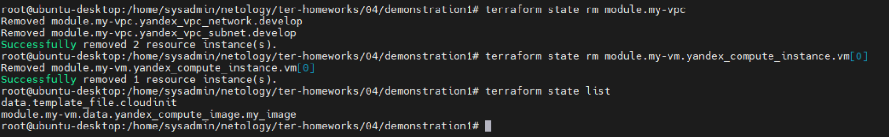
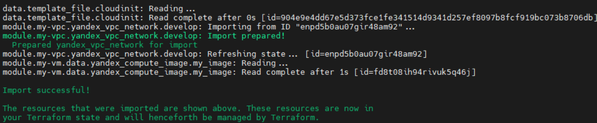
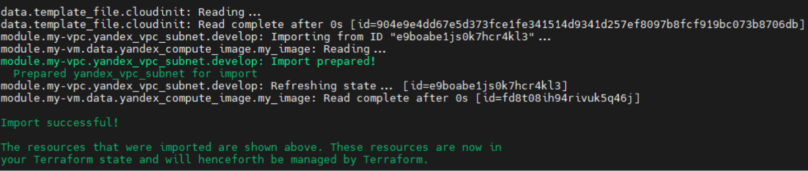
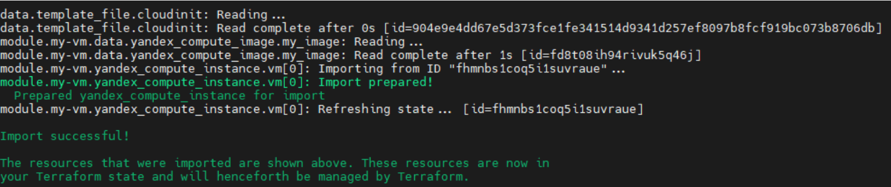
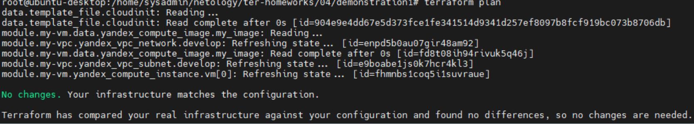
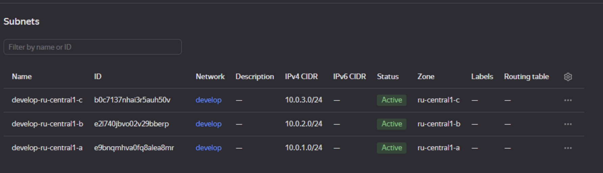

# Домашнее задание к занятию «Продвинутые методы работы с Terraform»

### Задание 1

1. Возьмите из [демонстрации к лекции готовый код](https://github.com/netology-code/ter-homeworks/tree/main/04/demonstration1) для создания ВМ с помощью remote-модуля.
2. Создайте одну ВМ, используя этот модуль. В файле cloud-init.yml необходимо использовать переменную для ssh-ключа вместо хардкода. Передайте ssh-ключ в функцию template_file в блоке vars ={} .
   Воспользуйтесь [**примером**](https://grantorchard.com/dynamic-cloudinit-content-with-terraform-file-templates/). Обратите внимание, что ssh-authorized-keys принимает в себя список, а не строку.
3. Добавьте в файл cloud-init.yml установку nginx.
4. Предоставьте скриншот подключения к консоли и вывод команды `sudo nginx -t`.

### Решение 1

## 

---

### Задание 2

1. Напишите локальный модуль vpc, который будет создавать 2 ресурса: **одну** сеть и **одну** подсеть в зоне, объявленной при вызове модуля, например: `ru-central1-a`.
2. Вы должны передать в модуль переменные с названием сети, zone и v4_cidr_blocks.
3. Модуль должен возвращать в root module с помощью output информацию о yandex_vpc_subnet. Пришлите скриншот информации из terraform console о своем модуле. Пример: > module.vpc_dev
4. Замените ресурсы yandex_vpc_network и yandex_vpc_subnet созданным модулем. Не забудьте передать необходимые параметры сети из модуля vpc в модуль с виртуальной машиной.
5. Откройте terraform console и предоставьте скриншот содержимого модуля. Пример: > module.vpc_dev.
6. Сгенерируйте документацию к модулю с помощью terraform-docs.

### Решение 2

## 

## Requirements

| Name                                                                     | Version |
| ------------------------------------------------------------------------ | ------- |
| <a name="requirement_terraform"></a> [terraform](#requirement_terraform) | >=0.13  |

## Providers

| Name                                                            | Version |
| --------------------------------------------------------------- | ------- |
| <a name="provider_template"></a> [template](#provider_template) | 2.2.0   |

## Modules

| Name                                                  | Source                                                      | Version |
| ----------------------------------------------------- | ----------------------------------------------------------- | ------- |
| <a name="module_my-vm"></a> [my-vm](#module_my-vm)    | git::https://github.com/udjin10/yandex_compute_instance.git | main    |
| <a name="module_my-vpc"></a> [my-vpc](#module_my-vpc) | ./vpc                                                       | n/a     |

## Resources

| Name                                                                                                                | Type        |
| ------------------------------------------------------------------------------------------------------------------- | ----------- |
| [template_file.cloudinit](https://registry.terraform.io/providers/hashicorp/template/latest/docs/data-sources/file) | data source |

## Inputs

| Name                                                                        | Description                                                                      | Type           | Default                                  | Required |
| --------------------------------------------------------------------------- | -------------------------------------------------------------------------------- | -------------- | ---------------------------------------- | :------: |
| <a name="input_cloud_id"></a> [cloud_id](#input_cloud_id)                   | https://cloud.yandex.ru/docs/resource-manager/operations/cloud/get-id            | `string`       | n/a                                      |   yes    |
| <a name="input_default_cidr"></a> [default_cidr](#input_default_cidr)       | https://cloud.yandex.ru/docs/vpc/operations/subnet-create                        | `string`       | `"10.0.1.0/24"`                          |    no    |
| <a name="input_default_zone"></a> [default_zone](#input_default_zone)       | https://cloud.yandex.ru/docs/overview/concepts/geo-scope                         | `string`       | `"ru-central1-a"`                        |    no    |
| <a name="input_env_name"></a> [env_name](#input_env_name)                   | n/a                                                                              | `string`       | `"develop"`                              |    no    |
| <a name="input_folder_id"></a> [folder_id](#input_folder_id)                | https://cloud.yandex.ru/docs/resource-manager/operations/folder/get-id           | `string`       | n/a                                      |   yes    |
| <a name="input_image_family"></a> [image_family](#input_image_family)       | n/a                                                                              | `string`       | `"ubuntu-2004-lts"`                      |    no    |
| <a name="input_instance_count"></a> [instance_count](#input_instance_count) | n/a                                                                              | `number`       | `1`                                      |    no    |
| <a name="input_instance_name"></a> [instance_name](#input_instance_name)    | n/a                                                                              | `string`       | `"web"`                                  |    no    |
| <a name="input_packages"></a> [packages](#input_packages)                   | n/a                                                                              | `list(string)` | <pre>[<br> "vim",<br> "nginx"<br>]</pre> |    no    |
| <a name="input_public_ip"></a> [public_ip](#input_public_ip)                | n/a                                                                              | `bool`         | `true`                                   |    no    |
| <a name="input_ssh_public_key"></a> [ssh_public_key](#input_ssh_public_key) | n/a                                                                              | `string`       | `"~/.ssh/id_rsa.pub"`                    |    no    |
| <a name="input_token"></a> [token](#input_token)                            | OAuth-token; https://cloud.yandex.ru/docs/iam/concepts/authorization/oauth-token | `string`       | n/a                                      |   yes    |
| <a name="input_username"></a> [username](#input_username)                   | ##cloud-init vars                                                                | `string`       | `"ubuntu"`                               |    no    |

## Outputs

No outputs.

### Задание 3

1. Выведите список ресурсов в стейте.

- terraform state list

## 

2. Полностью удалите из стейта модуль vpc.

- terraform state rm module.my-vpc

3. Полностью удалите из стейта модуль vm.

- terraform state rm module.my-vm.yandex_compute_instance.vm[0]

## 

4. Импортируйте всё обратно. Проверьте terraform plan. Изменений быть не должно.
   Приложите список выполненных команд и скриншоты процессы.

- terraform import 'module.my-vpc.yandex_vpc_network.develop' enpd5b0au07gir48am92

## 

- terraform import 'module.my-vpc.yandex_vpc_subnet.develop' e9boabe1js0k7hcr4kl3

## 

- terraform import 'module.my-vm.yandex_compute_instance.vm[0]' fhmnbs1coq5i1suvraue

## 

- terraform plan

## 

## Дополнительные задания (со звёздочкой\*)

**Настоятельно рекомендуем выполнять все задания со звёздочкой.** Они помогут глубже разобраться в материале.  
Задания со звёздочкой дополнительные, не обязательные к выполнению и никак не повлияют на получение вами зачёта по этому домашнему заданию.

### Задание 4\*

1. Измените модуль vpc так, чтобы он мог создать подсети во всех зонах доступности, переданных в переменной типа list(object) при вызове модуля.

Пример вызова

```
module "vpc_prod" {
  source       = "./vpc"
  env_name     = "production"
  subnets = [
    { zone = "ru-central1-a", cidr = "10.0.1.0/24" },
    { zone = "ru-central1-b", cidr = "10.0.2.0/24" },
    { zone = "ru-central1-c", cidr = "10.0.3.0/24" },
  ]
}

module "vpc_dev" {
  source       = "./vpc"
  env_name     = "develop"
  subnets = [
    { zone = "ru-central1-a", cidr = "10.0.1.0/24" },
  ]
}
```

Предоставьте код, план выполнения, результат из консоли YC.

Terraform used the selected providers to generate the following execution plan. Resource actions are indicated with the following symbols:

- create

Terraform will perform the following actions:

# module.my-vm.yandex_compute_instance.vm[0] will be created

- resource "yandex_compute_instance" "vm" {

  - allow_stopping_for_update = true
  - created_at = (known after apply)
  - description = "TODO: description; {{terraform managed}}"
  - folder_id = (known after apply)
  - fqdn = (known after apply)
  - gpu_cluster_id = (known after apply)
  - hostname = "develop-web-0"
  - id = (known after apply)
  - labels = {
    - "env" = "develop"
    - "project" = "undefined"
      }
  - metadata = {

    - "serial-port-enable" = "1"
    - "user-data" = <<-EOT
      #cloud-config
      users: - name: ubuntu
      groups: sudo
      shell: /bin/bash
      sudo: ['ALL=(ALL) NOPASSWD:ALL']
      ssh_authorized_keys: - ssh-rsa AAAAB3NzaC1yc2EAAAADAQABAAABgQDNdZXX1XUJIk37TdoXdDt7gTCtF02BJVhcLu390/iys+wj5QQ1jgCrWk5r6DRvdum6E8U5F8Ddfshm7wbgGVttj2cdHMqK8DiMAUeAW1Kh2bVXiy34QMnH355AzQ/9XmGSTL2w1AdtfbtARhZIkNxT07aEvMjv4ua2C0Nw14oX5t2EEQckQzCAL1+nncoPvJwJBlmt1sVKlGuQtGD+2PnQpdM/Y6sB9ovxlMtxSUvZLXRue9HtcYI+Ctpl24zFcHThpkX2ptCuA7BrZ1Mqc2oN3heRwsFEc+zE2zyXGclMPEJ8/QqjoklPaszVg5VGpyjY1RPWfdxLYa4nTSxkhbxpD0afmS6s6O4nS2hKV6zDvtYzm8FZbpo6UoqvmIwh+klGXp02Psls1dgDG5Peem9kkEnfT2g2UZUY7vTpbKMD+Eneea0gBjZwiATuKj3EJpXGeI/sYFjR6vFH00IWzKtaAF/OgGrMope8ZDqMj2ITtRj8xVZ7lHCQGi/DEim9rj8= root@ubuntu-desktop

              package_update: true
              package_upgrade: false
              packages: ["vim","nginx"]
          EOT

      }

  - name = "develop-web-0"
  - network_acceleration_type = "standard"
  - platform_id = "standard-v1"
  - service_account_id = (known after apply)
  - status = (known after apply)
  - zone = "ru-central1-a"

  - boot_disk {

    - auto_delete = true
    - device_name = (known after apply)
    - disk_id = (known after apply)
    - mode = (known after apply)

    - initialize_params { + block_size = (known after apply) + description = (known after apply) + image_id = "fd8pqclrbi85ektgehlf" + name = (known after apply) + size = 10 + snapshot_id = (known after apply) + type = "network-hdd"
      }
      }

  - network_interface {

    - index = (known after apply)
    - ip_address = (known after apply)
    - ipv4 = true
    - ipv6 = (known after apply)
    - ipv6_address = (known after apply)
    - mac_address = (known after apply)
    - nat = true
    - nat_ip_address = (known after apply)
    - nat_ip_version = (known after apply)
    - security_group_ids = (known after apply)
    - subnet_id = (known after apply)
      }

  - resources {

    - core_fraction = 5
    - cores = 2
    - memory = 1
      }

  - scheduling_policy { + preemptible = true
    }
    }

# module.my-vm.yandex_compute_instance.vm[1] will be created

- resource "yandex_compute_instance" "vm" {

  - allow_stopping_for_update = true
  - created_at = (known after apply)
  - description = "TODO: description; {{terraform managed}}"
  - folder_id = (known after apply)
  - fqdn = (known after apply)
  - gpu_cluster_id = (known after apply)
  - hostname = "develop-web-1"
  - id = (known after apply)
  - labels = {
    - "env" = "develop"
    - "project" = "undefined"
      }
  - metadata = {

    - "serial-port-enable" = "1"
    - "user-data" = <<-EOT
      #cloud-config
      users: - name: ubuntu
      groups: sudo
      shell: /bin/bash
      sudo: ['ALL=(ALL) NOPASSWD:ALL']
      ssh_authorized_keys: - ssh-rsa AAAAB3NzaC1yc2EAAAADAQABAAABgQDNdZXX1XUJIk37TdoXdDt7gTCtF02BJVhcLu390/iys+wj5QQ1jgCrWk5r6DRvdum6E8U5F8Ddfshm7wbgGVttj2cdHMqK8DiMAUeAW1Kh2bVXiy34QMnH355AzQ/9XmGSTL2w1AdtfbtARhZIkNxT07aEvMjv4ua2C0Nw14oX5t2EEQckQzCAL1+nncoPvJwJBlmt1sVKlGuQtGD+2PnQpdM/Y6sB9ovxlMtxSUvZLXRue9HtcYI+Ctpl24zFcHThpkX2ptCuA7BrZ1Mqc2oN3heRwsFEc+zE2zyXGclMPEJ8/QqjoklPaszVg5VGpyjY1RPWfdxLYa4nTSxkhbxpD0afmS6s6O4nS2hKV6zDvtYzm8FZbpo6UoqvmIwh+klGXp02Psls1dgDG5Peem9kkEnfT2g2UZUY7vTpbKMD+Eneea0gBjZwiATuKj3EJpXGeI/sYFjR6vFH00IWzKtaAF/OgGrMope8ZDqMj2ITtRj8xVZ7lHCQGi/DEim9rj8= root@ubuntu-desktop

              package_update: true
              package_upgrade: false
              packages: ["vim","nginx"]
          EOT

      }

  - name = "develop-web-1"
  - network_acceleration_type = "standard"
  - platform_id = "standard-v1"
  - service_account_id = (known after apply)
  - status = (known after apply)
  - zone = "ru-central1-a"

  - boot_disk {

    - auto_delete = true
    - device_name = (known after apply)
    - disk_id = (known after apply)
    - mode = (known after apply)

    - initialize_params { + block_size = (known after apply) + description = (known after apply) + image_id = "fd8pqclrbi85ektgehlf" + name = (known after apply) + size = 10 + snapshot_id = (known after apply) + type = "network-hdd"
      }
      }

  - network_interface {

    - index = (known after apply)
    - ip_address = (known after apply)
    - ipv4 = true
    - ipv6 = (known after apply)
    - ipv6_address = (known after apply)
    - mac_address = (known after apply)
    - nat = true
    - nat_ip_address = (known after apply)
    - nat_ip_version = (known after apply)
    - security_group_ids = (known after apply)
    - subnet_id = (known after apply)
      }

  - resources {

    - core_fraction = 5
    - cores = 2
    - memory = 1
      }

  - scheduling_policy { + preemptible = true
    }
    }

# module.my-vm.yandex_compute_instance.vm[2] will be created

- resource "yandex_compute_instance" "vm" {

  - allow_stopping_for_update = true
  - created_at = (known after apply)
  - description = "TODO: description; {{terraform managed}}"
  - folder_id = (known after apply)
  - fqdn = (known after apply)
  - gpu_cluster_id = (known after apply)
  - hostname = "develop-web-2"
  - id = (known after apply)
  - labels = {
    - "env" = "develop"
    - "project" = "undefined"
      }
  - metadata = {

    - "serial-port-enable" = "1"
    - "user-data" = <<-EOT
      #cloud-config
      users: - name: ubuntu
      groups: sudo
      shell: /bin/bash
      sudo: ['ALL=(ALL) NOPASSWD:ALL']
      ssh_authorized_keys: - ssh-rsa AAAAB3NzaC1yc2EAAAADAQABAAABgQDNdZXX1XUJIk37TdoXdDt7gTCtF02BJVhcLu390/iys+wj5QQ1jgCrWk5r6DRvdum6E8U5F8Ddfshm7wbgGVttj2cdHMqK8DiMAUeAW1Kh2bVXiy34QMnH355AzQ/9XmGSTL2w1AdtfbtARhZIkNxT07aEvMjv4ua2C0Nw14oX5t2EEQckQzCAL1+nncoPvJwJBlmt1sVKlGuQtGD+2PnQpdM/Y6sB9ovxlMtxSUvZLXRue9HtcYI+Ctpl24zFcHThpkX2ptCuA7BrZ1Mqc2oN3heRwsFEc+zE2zyXGclMPEJ8/QqjoklPaszVg5VGpyjY1RPWfdxLYa4nTSxkhbxpD0afmS6s6O4nS2hKV6zDvtYzm8FZbpo6UoqvmIwh+klGXp02Psls1dgDG5Peem9kkEnfT2g2UZUY7vTpbKMD+Eneea0gBjZwiATuKj3EJpXGeI/sYFjR6vFH00IWzKtaAF/OgGrMope8ZDqMj2ITtRj8xVZ7lHCQGi/DEim9rj8= root@ubuntu-desktop

              package_update: true
              package_upgrade: false
              packages: ["vim","nginx"]
          EOT

      }

  - name = "develop-web-2"
  - network_acceleration_type = "standard"
  - platform_id = "standard-v1"
  - service_account_id = (known after apply)
  - status = (known after apply)
  - zone = "ru-central1-a"

  - boot_disk {

    - auto_delete = true
    - device_name = (known after apply)
- disk_id = (known after apply)
    - mode = (known after apply)

    - initialize_params { + block_size = (known after apply) + description = (known after apply) + image_id = "fd8pqclrbi85ektgehlf" + name = (known after apply) + size = 10 + snapshot_id = (known after apply) + type = "network-hdd"
      }
      }

  - network_interface {

    - index = (known after apply)
    - ip_address = (known after apply)
    - ipv4 = true
    - ipv6 = (known after apply)
    - ipv6_address = (known after apply)
    - mac_address = (known after apply)
    - nat = true
    - nat_ip_address = (known after apply)
    - nat_ip_version = (known after apply)
    - security_group_ids = (known after apply)
    - subnet_id = (known after apply)
      }

  - resources {

    - core_fraction = 5
    - cores = 2
    - memory = 1
      }

  - scheduling_policy { + preemptible = true
    }
    }

# module.my-vpc.yandex_vpc_network.develop will be created

- resource "yandex_vpc_network" "develop" {
  - created_at = (known after apply)
  - default_security_group_id = (known after apply)
  - folder_id = (known after apply)
  - id = (known after apply)
  - labels = (known after apply)
  - name = "develop"
  - subnet_ids = (known after apply)
    }

# module.my-vpc.yandex_vpc_subnet.develop["ru-central1-a"] will be created

- resource "yandex_vpc_subnet" "develop" {
  - created_at = (known after apply)
  - folder_id = (known after apply)
  - id = (known after apply)
  - labels = (known after apply)
  - name = "develop-ru-central1-a"
  - network_id = (known after apply)
  - v4_cidr_blocks = [
    - "10.0.1.0/24",
      ]
  - v6_cidr_blocks = (known after apply)
  - zone = "ru-central1-a"
    }

# module.my-vpc.yandex_vpc_subnet.develop["ru-central1-b"] will be created

- resource "yandex_vpc_subnet" "develop" {
  - created_at = (known after apply)
  - folder_id = (known after apply)
  - id = (known after apply)
  - labels = (known after apply)
  - name = "develop-ru-central1-b"
  - network_id = (known after apply)
  - v4_cidr_blocks = [
    - "10.0.2.0/24",
      ]
  - v6_cidr_blocks = (known after apply)
  - zone = "ru-central1-b"
    }

# module.my-vpc.yandex_vpc_subnet.develop["ru-central1-c"] will be created

- resource "yandex_vpc_subnet" "develop" {
  - created_at = (known after apply)
  - folder_id = (known after apply)
  - id = (known after apply)
  - labels = (known after apply)
  - name = "develop-ru-central1-c"
  - network_id = (known after apply)
  - v4_cidr_blocks = [
    - "10.0.3.0/24",
      ]
  - v6_cidr_blocks = (known after apply)
  - zone = "ru-central1-c"
    }

## 
